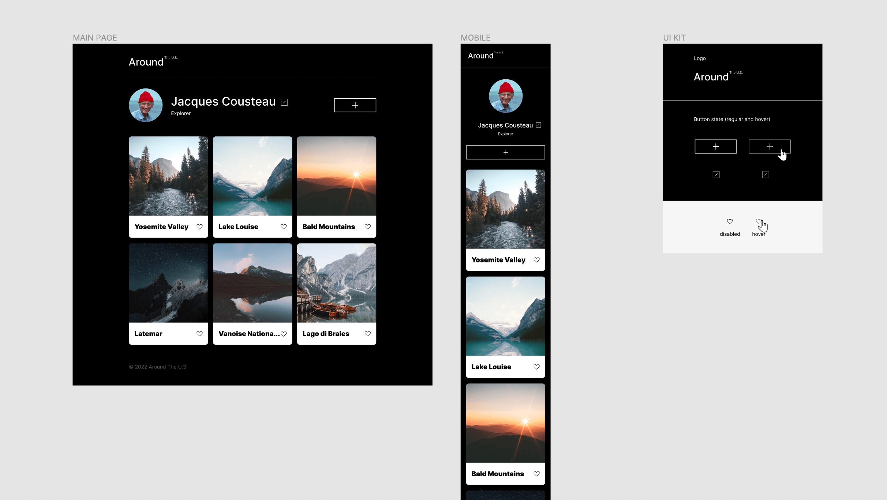
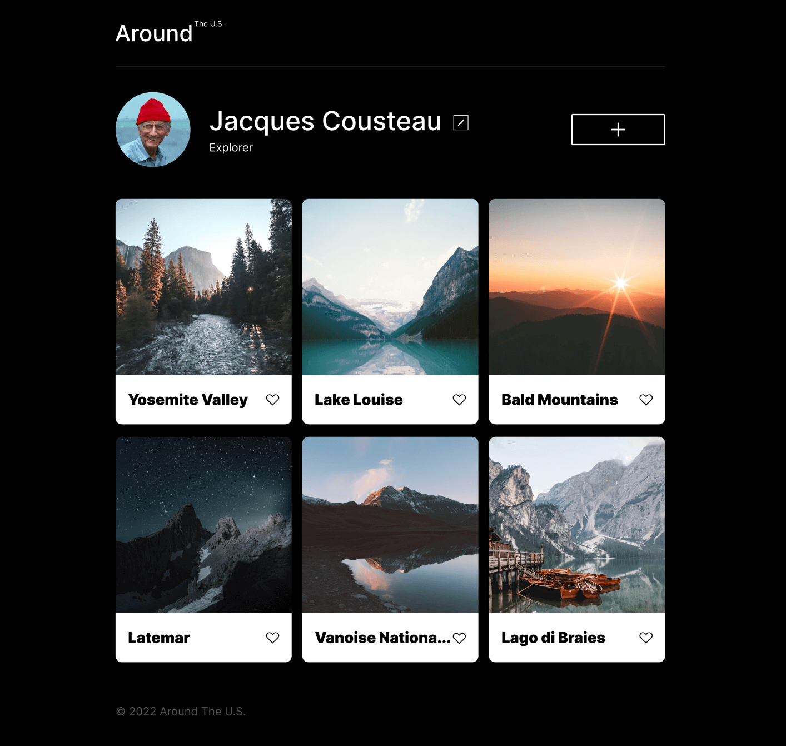
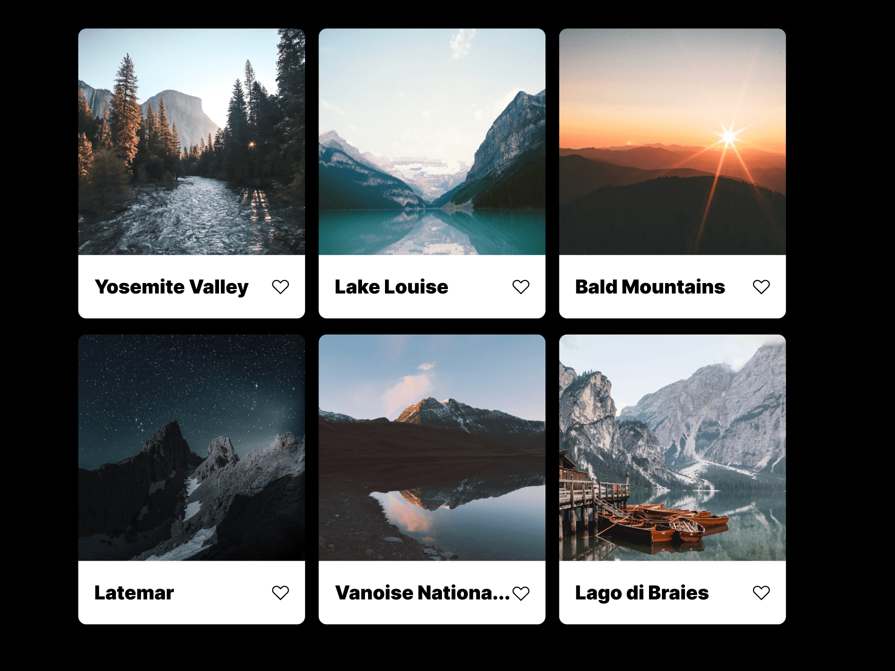
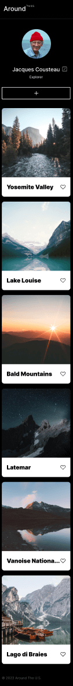

# Project 3: Around The U.S.

### Overview

- Intro
- Features
- Future Add-Ons
- Figma
- Images

**Intro**

This project is a webpage created using HTML and CSS, with a primary focus on responsive layout design and the implementation of CSS Grid. It serves as an example of a social media profile, complete with a person's profile information, edit buttons, and a responsive grid displaying photos and their descriptions.

**Features**

- **Responsive Layout:** The webpage is designed to adapt seamlessly to different screen sizes, ensuring a consistent user experience across various devices.

- **CSS Grid:** The project utilizes the power of CSS Grid to efficiently organize and display the photo grid, making it visually appealing and user-friendly.

- **Profile Information:** The webpage showcases a person's profile information, providing a realistic social media profile experience.

- **Edit Buttons:** Users can interact with the profile through edit buttons, enhancing the interactivity of the webpage.

**Future Add-Ons**

In future versions of this project, I plan to incorporate JavaScript to make the webpage even more dynamic and interactive:

- **Interactive Buttons:** We will implement JavaScript to make the edit buttons interactive, allowing users to edit their profile information directly on the webpage.

- **Add and Delete Images:** JavaScript will be used to enable users to add and delete images to/from their profile, providing a more comprehensive social media experience.

**Figma**

- [Link to the project on Figma](https://www.figma.com/file/ii4xxsJ0ghevUOcssTlHZv/Sprint-3%3A-Around-the-US?node-id=0%3A1)

**GitHub Pages**

- [Link to the project on GitHub Pages](https://melvar1.github.io/se_project_aroundtheus/)

**Images**

